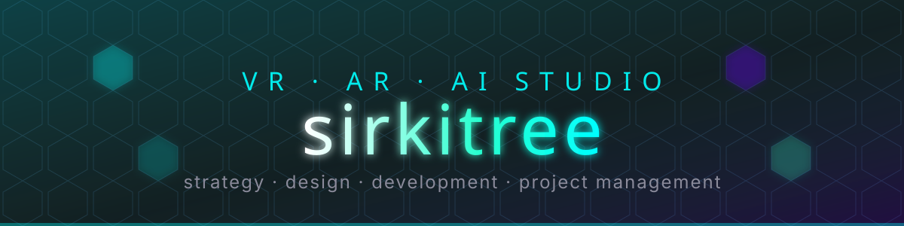

---

I build at the edge of immersive tech and AI — VR and AR experiences, agent tooling, and the boring-but-critical plumbing that makes both ship. Twenty-some years in open source (a lot of it Drupal), currently spending most of my time on AI agents, Claude Code tooling, and spatial computing.

Fully distributed, honest partnerships, candid feedback. That's the whole pitch.

### Currently

- Building Claude Code plugins and skills — [conversation-logger](https://github.com/sirkitree/conversation-logger), [claude-conversation-saver](https://github.com/sirkitree/claude-conversation-saver), [slack-markdown-formatter](https://github.com/sirkitree/slack-markdown-formatter)
- VR / AR consulting and metaverse prototyping through [sirkitree.net](https://sirkitree.net)
- Writing at [jeradbitner.com](https://jeradbitner.com) about AI tooling, engineering practice, and whatever else won't leave me alone
- Generative art on [fx(hash)](https://www.fxhash.xyz/generative/26194), [Objkt](https://objkt.com/profile/tz1dCtXiYhZcRbBizGzzcw9Tnkpiz5t8BfnD), and [OpenSea](https://opensea.io/sirkitree)

### Toolkit

### Signals

### Selected work

| | |
|---|---|
| [**claude-conversation-saver**](https://github.com/sirkitree/claude-conversation-saver)   Auto-saves and indexes your Claude Code conversations. |  |
| [**conversation-logger**](https://github.com/sirkitree/conversation-logger)   Skill for saving, searching, and retrieving transcripts. |  |
| [**angular-directive.g-signin**](https://github.com/sirkitree/angular-directive.g-signin)   AngularJS directive for the Google Plus sign-in button. |  |
| [**DrupalCodingStandard**](https://github.com/sirkitree/DrupalCodingStandard)   Sublime build script for Drupal Code Sniffer. |  |
| [**slack-markdown-formatter**](https://github.com/sirkitree/slack-markdown-formatter)   Skill for Slack mrkdwn formatting. |  |

### Elsewhere

  

